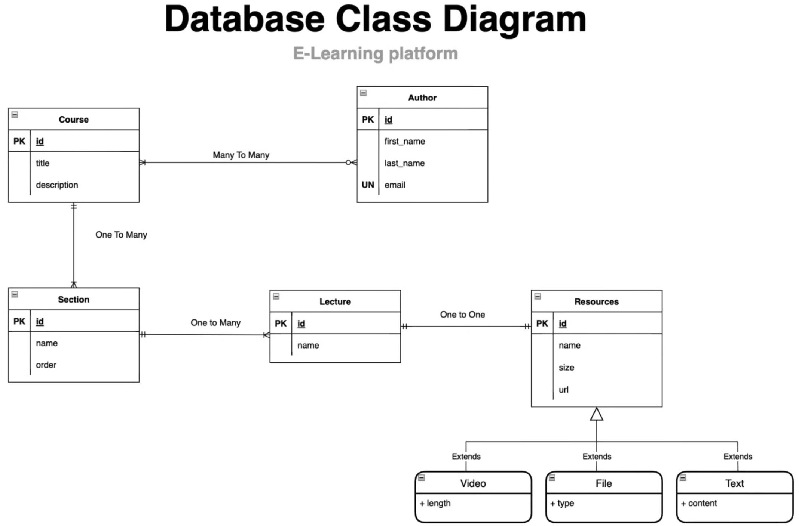
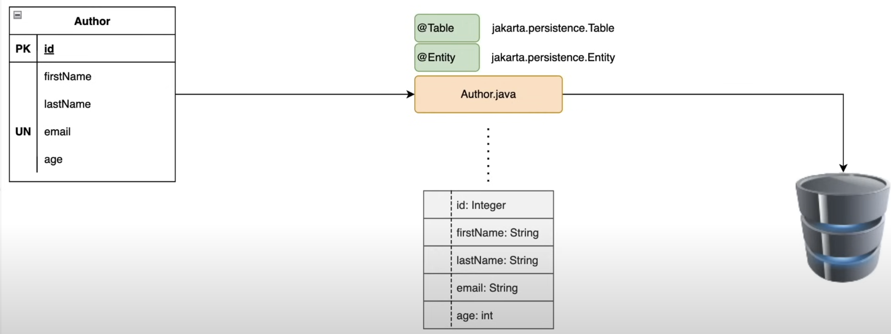
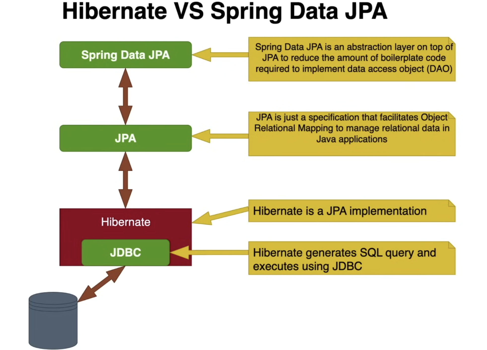
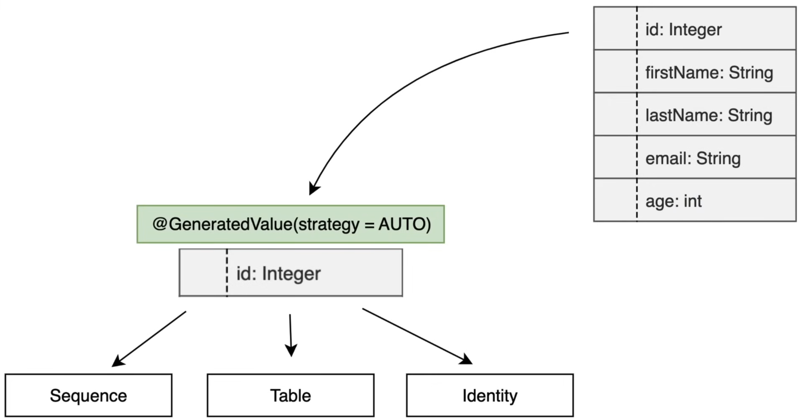
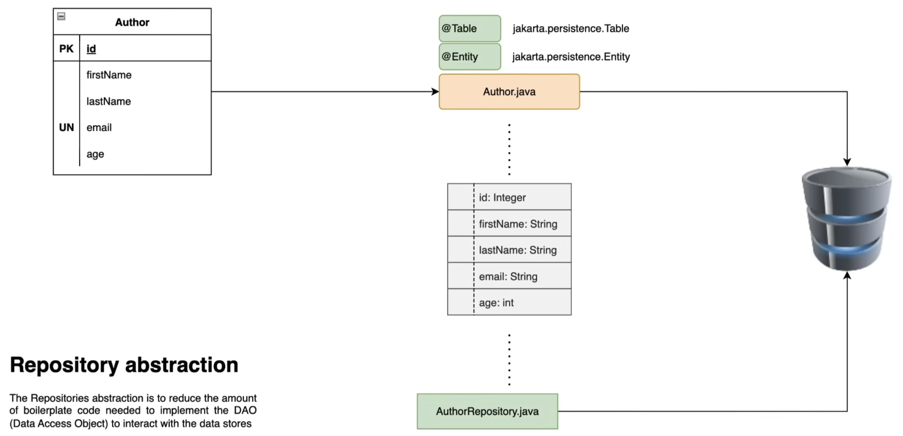
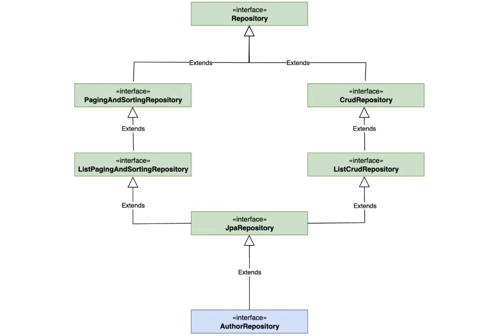
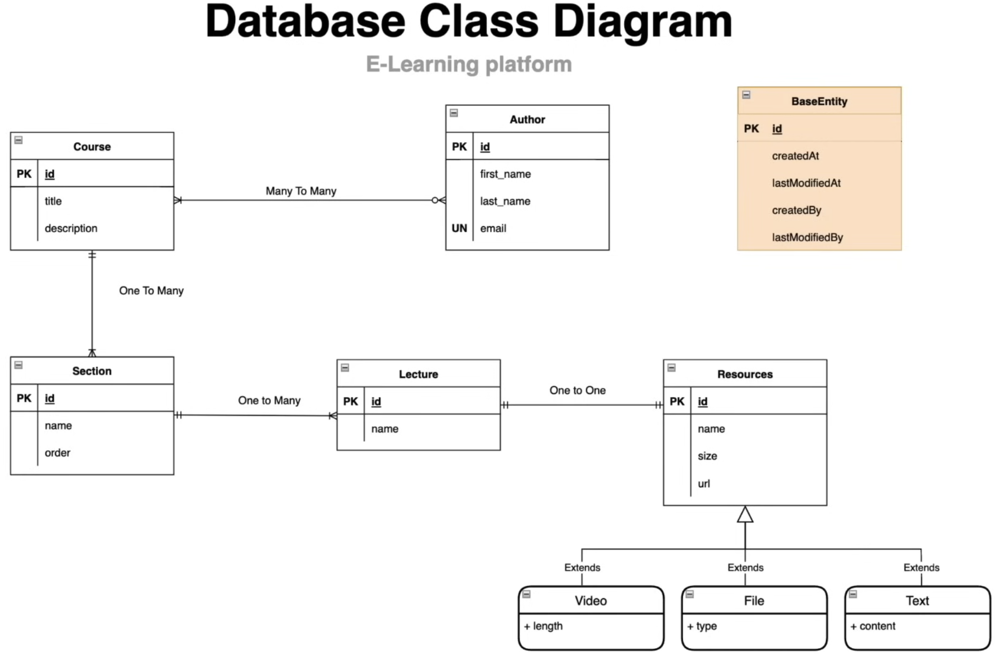
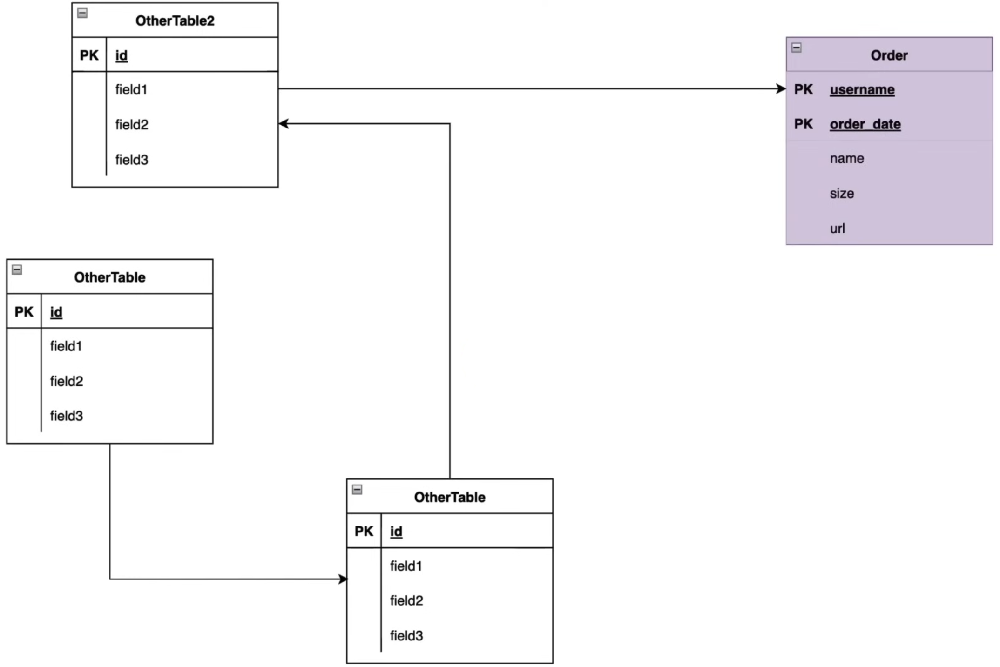
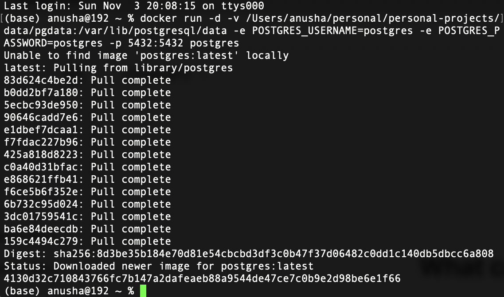
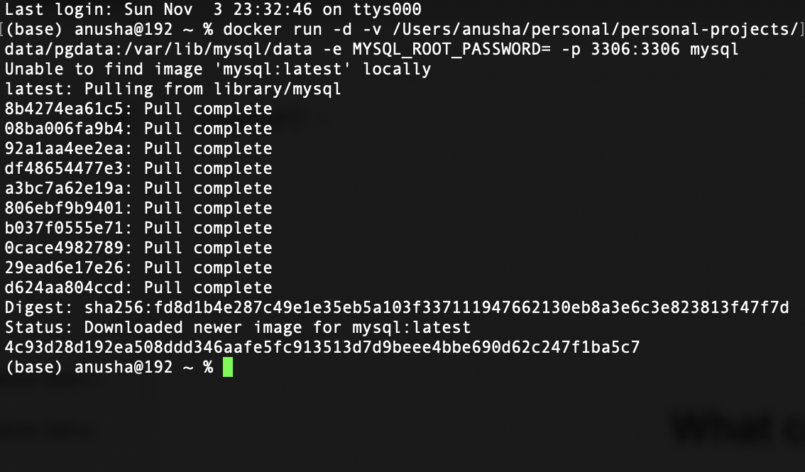

# E-learning-platform
***

## Table of Contents
- ### [Overview](#overview)
- ### [Features](#features)
- ### [Diagrams](#diagrams)
- ### [Technologies Used](#technologies-used)
- ### [Learning Objectives](#learning-objectives)
- ### [Get Started](#get-started)
- ### [Documentation](#documentation)
***

## Overview
E-learning platform is designed to facilitate the management and delivery of educational content. It provides key functionalities for managing authors, lectures, sections, course and resources, including files, videos, and text. The system is built to support an organized structure for educational courses, enabling easy access to various types of resources.
***

## Features:
- Author Management: Allows the creation and management of authors who can contribute educational content.
- Lecture Management: Organizes lectures under specific courses.
- Section Management: Courses are divided into sections for better navigation and progression.
- Course Resources: Supports various types of course materials, including
  - Files: Attach supplementary resources.
  - Videos: Embed or link video content for lectures.
  - Text: Provide text-based resources for in-depth learning.
***

## Diagrams
#### Database Class Diagram

 
 

#### Transform database table to java class

 
 

#### Difference between Hibernate and Spring Data JPA

 
 

#### Different types of generation strategies

 
 

#### Use JpaRepository to implement dao layer to interact with database and abstract data access layer from business logic

 
 

#### Hierarchy of JpaRepository 

 
 

#### Hibernate Entity Lifecycle

 
 

#### Use inheritance on common field having entity classes by creating BaseEntity class to avoid code duplication

 
 

#### Use Embeddable and EmbeddedId to define composite primary key

 

#### Install-PostgreSQL using docker

 
 

#### Install MySQL using docker

 
 
***

## Technologies Used
- Spring Boot 3
- Spring Data JPA
- Spring Validation
- Docker
- PostgreSQL
- MySQL
- Git & GitHub
***

## Learning Objectives
- Designing a class diagram from business requirements
- Utilizing inheritance with Spring Data JPA
- Object validation using Spring Validation
- Using Spring Profiles for environment-specific configurations
- Implementing business requirements and handling business exceptions
***

## Get Started
To get started with the e-learning platform project, follow the given setup instructions respectively
- Clone this repository.
- Configure your database (PostgreSQL or MySQL) settings in the application properties.
- Run the application using your preferred IDE or build tools.
***

## Documentation
- [Entity relationship types in JPA](docs/entity-relationship-types-in-jpa/README.md)
- [Ways to implement Inheritance in JPA](docs/ways-to-implement-inheritance-in-jpa/README.md)
- [Why use composition over inheritance](docs/why-use-composition-over-inheritance/README.md)