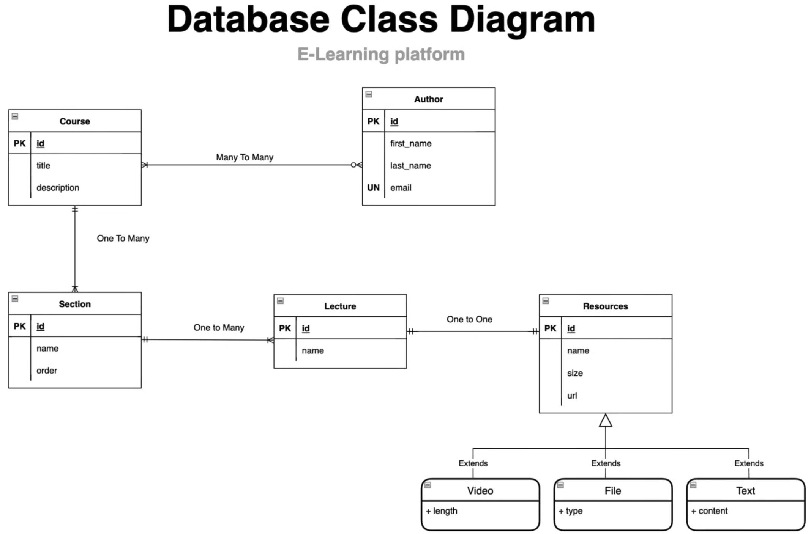
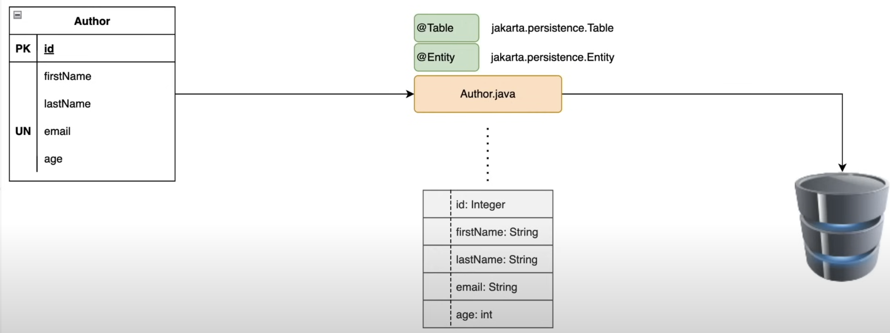
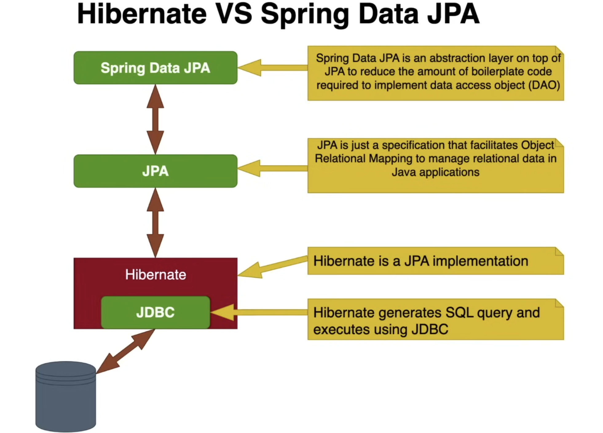
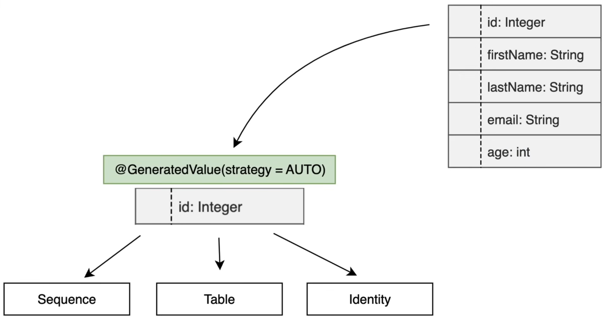
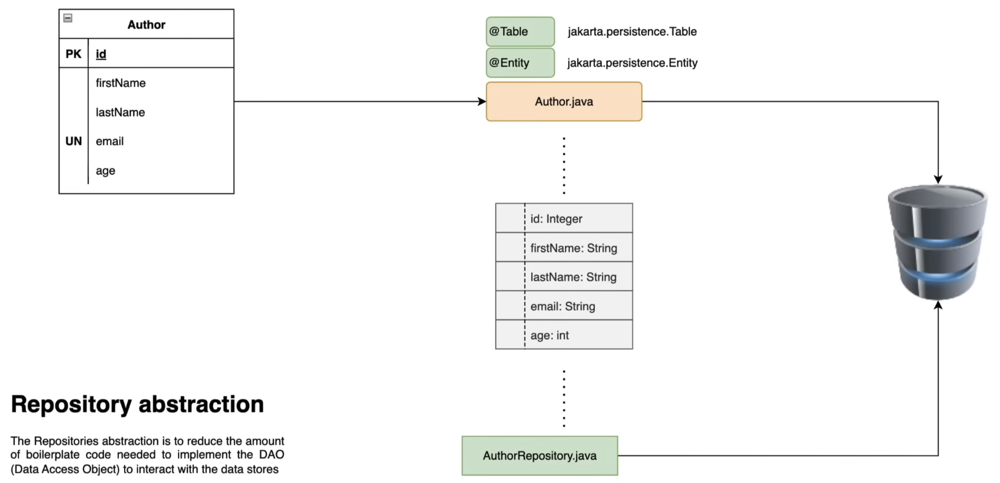
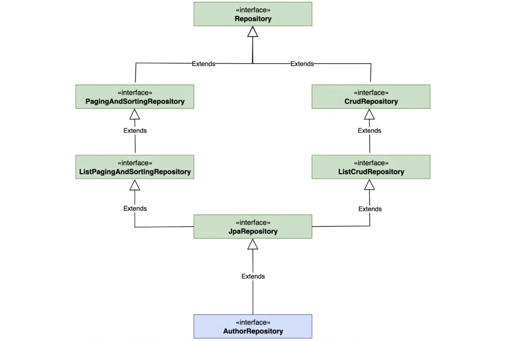
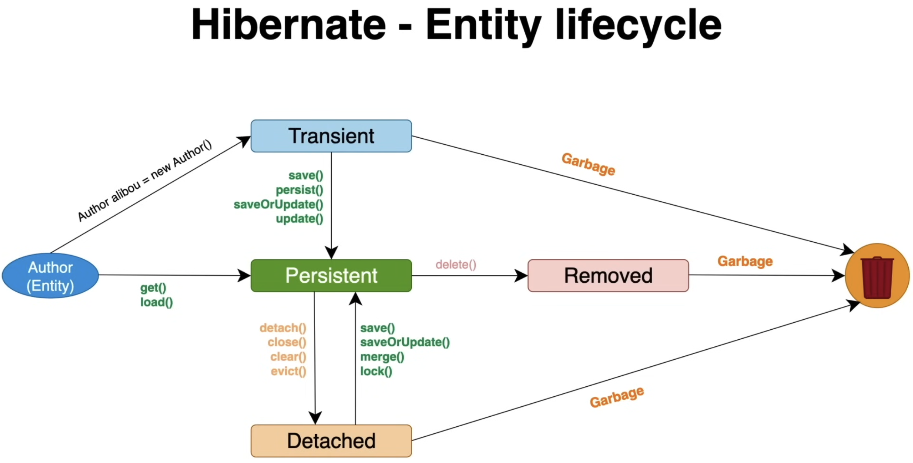
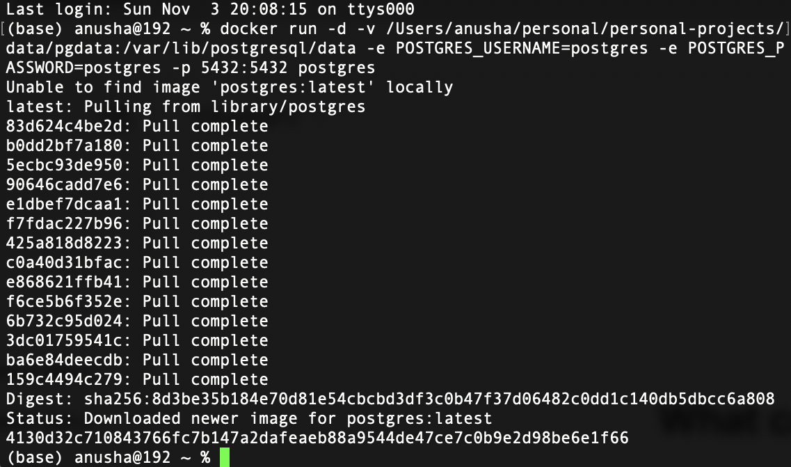
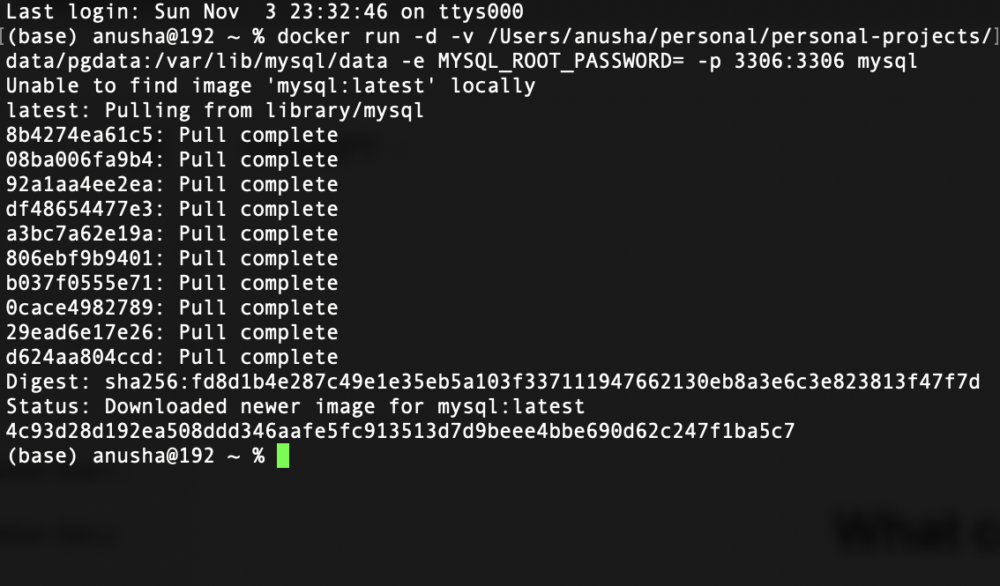

# e-learning-platform

- #### Database Class Diagram

- #### Transform database table to java class

- #### Difference between Hibernate and Spring Data JPA

- #### Difference between Hibernate and Spring Data JPA

- #### Different types of generation strategies

- #### Use JpaRepository to implement dao layer to interact with database and abstract data access layer from business logic

- #### Hierarchy of JpaRepository 

- #### Hibernate Entity Lifecycle

- #### Install-PostgreSQL using docker

- #### Install MySQL using docker
